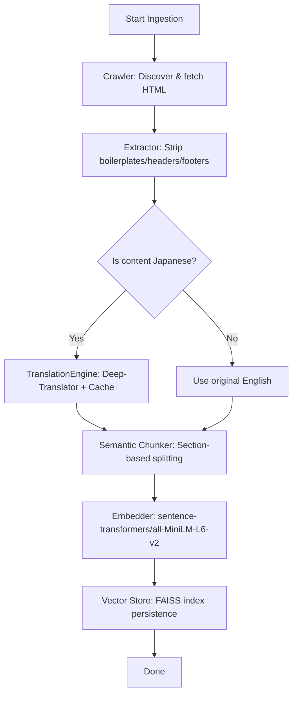
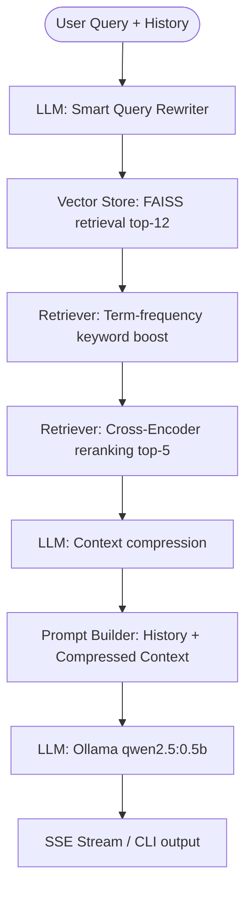

# MMI-KNOWLEDGE RAG CHATBOT

An enterprise-grade, local-first Retrieval-Augmented Generation (RAG) system built to scrape, translate, index, and query knowledge from the official website of Man-Machine Interface Co., Ltd. ([mmi-sc.co.jp](https://www.mmi-sc.co.jp/)).

The project features a **hybrid semantic search pipeline**, **Japanese-to-English translation caching**, **Server-Sent Events (SSE) streaming**, and a bilingual conversation memory engine. It is accessible via both a rich terminal-based CLI chatbot and a premium Web UI Dashboard.

---

## 🏗️ Architecture Overview

The system is separated into two primary workflows: **Knowledge Ingestion Pipeline** and **Query & Inference Flow**.

### 1. Ingestion Pipeline


### 2. Query & Inference Flow


---

## 🛠️ Technology Stack

- **Backend Framework**: [FastAPI](https://fastapi.tiangolo.com/) (REST APIs & SSE streaming), [Uvicorn](https://www.uvicorn.org/) (server).
- **Web Scraping & Extraction**: `BeautifulSoup4` (HTML parsing) & `trafilatura` (boilerplate-free content extraction).
- **Translation Layer**: `deep-translator` (Google Translate engine) with local cache manager.
- **Embeddings & Vector Search**: [FAISS](https://github.com/facebookresearch/faiss) (`faiss-cpu`) & `sentence-transformers/all-MiniLM-L6-v2` (384-dimensional dense vectors).
- **Re-ranking**: `cross-encoder/ms-marco-MiniLM-L-6-v2` (cross-attention model to score passage relevance).
- **Inference LLM**: Local [Ollama](https://ollama.com/) daemon running a lightweight and fast model (`qwen2.5:0.5b`).
- **Caching Layer**: Redis client (with automatic fallback to in-memory caching).
- **Frontend Dashboard**: Semantic HTML5, Vanilla CSS3 (featuring premium glassmorphism, HSL tailormade colors, and micro-animations), and asynchronous Vanilla JS.

---

## 📁 Codebase Structure

All key components are modularly organized:

- ⚙️ **Config & Cache**
  - [config.py](file:///Users/arronkianparejas/RAG(MMI)/config.py) – Holds model configurations, directories, chunking limits, and API parameters.
  - [cache_manager.py](file:///Users/arronkianparejas/RAG(MMI)/cache_manager.py) – Connects to Redis for caching query results, falling back to a thread-safe local memory cache.
- 🕷️ **Ingestion Pipeline**
  - [crawler.py](file:///Users/arronkianparejas/RAG(MMI)/crawler.py) – Recursive website crawler with link discovery, depth-limiting, and state caching (`crawl_cache.json`).
  - [extractor.py](file:///Users/arronkianparejas/RAG(MMI)/extractor.py) – Strips website navigation headers, sidebars, and footers, extracting clean main texts and page headings.
  - [translator.py](file:///Users/arronkianparejas/RAG(MMI)/translator.py) – Detects source language (using `langdetect`) and translates Japanese blocks to English. Utilizes local caching (`translation_cache.json`) to prevent redundant API calls.
  - [chunker.py](file:///Users/arronkianparejas/RAG(MMI)/chunker.py) – Splits extracted pages into semantic chunks aligned by headings and paragraph breaks to keep passages clean and contextual.
- 🗄️ **Database & Search**
  - [vector_db.py](file:///Users/arronkianparejas/RAG(MMI)/vector_db.py) – Handles FAISS index creation, chunk persistence, and similarity searches.
  - [retriever.py](file:///Users/arronkianparejas/RAG(MMI)/retriever.py) – Implements **Hybrid Retrieval**: retrieves candidate chunks from FAISS, applies keyword frequency term boosting, and reranks them using a Cross-Encoder.
- 🧠 **Inference & API**
  - [llm.py](file:///Users/arronkianparejas/RAG(MMI)/llm.py) – Connects to Ollama. Manages smart query rewriting, context compression, prompt formatting (injecting chat history), and token streaming.
  - [api.py](file:///Users/arronkianparejas/RAG(MMI)/api.py) – FastAPI application exposing endpoints for background crawling, chat querying, and service health checks.
- 💻 **Interfaces & Verification**
  - [chatbot.py](file:///Users/arronkianparejas/RAG(MMI)/chatbot.py) – Interactive terminal CLI chatbot with full streaming, citation list formatting, and crawl utilities.
  - [verify_rag.py](file:///Users/arronkianparejas/RAG(MMI)/verify_rag.py) – Local integration verification suite executing automated tests for extraction, translation, database operations, and LLM connectivity.
  - [static/](file:///Users/arronkianparejas/RAG(MMI)/static/) – Contains the frontend source:
    - [index.html](file:///Users/arronkianparejas/RAG(MMI)/static/index.html) – Semantic markup for the control center and RAG panel.
    - [app.css](file:///Users/arronkianparejas/RAG(MMI)/static/app.css) – Styling sheets with a high-end glassmorphism dark theme, smooth gradient transitions, and responsive grid layouts.
    - [app.js](file:///Users/arronkianparejas/RAG(MMI)/static/app.js) – Asynchronous JS handling Server-Sent Events, real-time message bubbles, ingestion triggers, and history synchronization.

---

## 🚀 Setup and Installation

### 1. Prerequisites
- **Python**: Version 3.11 or higher.
- **Ollama**: Ensure Ollama is installed and running on your local machine.

### 2. Ollama Configuration
Start the Ollama daemon and pull the target model:
```bash
# Pull the lightweight qwen2.5 model
ollama pull qwen2.5:0.5b
```

### 3. Clone and Initialize Environment
Navigate to the project root directory and create a virtual environment:
```bash
# Create virtual environment
python3 -m venv venv

# Activate virtual environment
source venv/bin/activate

# Install requirements
pip install -r requirements.txt
```

---

## 🧪 Verification and Component Testing

Verify that all components are configured properly and can reach external translation/model APIs:
```bash
python verify_rag.py
```
*A successful test output will show checkmarks (`✓`) next to Config, Content Extraction, Language Detection, Translation Layer, Chunker, Vector DB, and Ollama connection checks.*

---

## 🏃 Running the Application

There are two ways to interact with the MMI-Knowledge RAG System:

### Option A: The Terminal-based Interactive CLI (`chatbot.py`)
Run the terminal chatbot to scrape the website and chat interactively:
```bash
python chatbot.py
```
**Interactive Options in CLI**:
- **Option 1**: Start a full crawl & build a new vector index. Run this on your first execution to populate the database.
- **Option 2**: Jump straight to chat using the existing database index.

### Option B: The Web UI Dashboard & FastAPI Server
1. **Start the API Server**:
   ```bash
   uvicorn api:app --host 127.0.0.1 --port 8000 --reload
   ```
2. **Access the Dashboard**:
   Open your browser and navigate to:
   👉 **[http://127.0.0.1:8000/](http://127.0.0.1:8000/)**

#### Web Dashboard Features:
- 📊 **Control Center**: Trigger recursive crawls and monitor ingestion progress (e.g., crawled page counts, vectors generated) in real-time.
- 💬 **Interactive Chat Area**: Chat with the agent, enjoy smooth response streaming, and view conversation-history-grounded answers.
- 🔗 **Citations Viewer**: Examine the grounded page links, titles, sections, and relevance match scores for every source used.
- 🩺 **Health Monitor**: Live status checks for Ollama connectivity, Redis connection, and the total indexed vector count.
